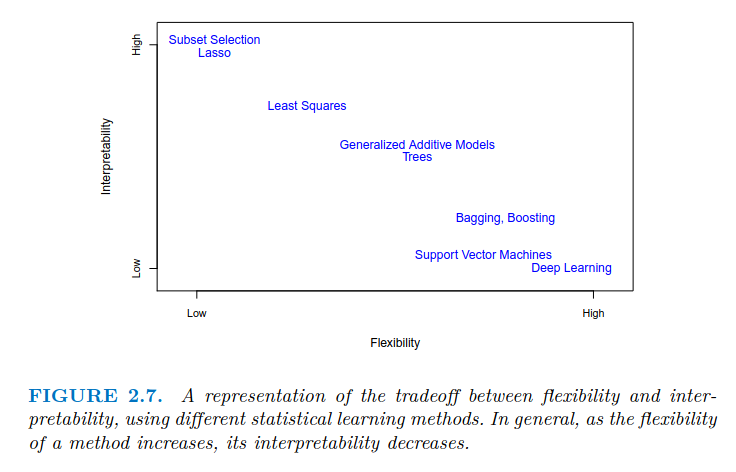

# An Introduction to Statistical Learning

## 1 Introduction (done)

## 2 Statistical Learning

### Multiple objectives:

- Prediction:
  - Predict the value of a response variable based on the values of other variables.
  - Example: Predicting house prices based on features like size, location, etc.
- Inference:
  - Understand the relationship between the response variable and the predictors.
  - Example: Understanding how different factors affect house prices.
- Combination of both:
  - Predicting house prices while also understanding the impact of different features.

### Two types of method:

#### Parametric methods:

- Make assumptions about the functional form of the relationship between predictors and response.

- Example: Linear regression assumes a linear relationship (y = β0 + β1x1 + β2x2 + ... + ε).

- Assumptions:

  - The relationship between predictors and response is linear.
  - The errors are normally distributed.
  - Homoscedasticity (constant variance of errors).
  - Independence of errors.

- Advantages:

  - Simplicity and interpretability.
  - Fewer parameters to estimate, leading to less overfitting.
  - Easier to compute and faster to train.

- Disadvantages:

  - May not capture complex relationships.
  - Assumptions may not hold true in practice.
  - Limited flexibility in modeling.

#### Non-parametric methods:

- Do not make strong assumptions about the functional form of the relationship.

- Advantages:

  - Flexibility to capture complex relationships.
  - Can model non-linear relationships without specific assumptions.
  - Can adapt to the data structure.

- Disadvantages:

  - More parameters to estimate, leading to potential overfitting.
  - Computationally intensive and slower to train.
  - Less interpretable than parametric methods.

#### Measuring the quality of the fit of a model:

Regression:

Mean Squared Error $$MSE = \frac{1}{n} \sum_{i=1}^{n} (y_i - \hat{f}(x_i))^2$$

Classification:

- Classification error rate $$\frac{1}{n} \sum_{i=1}^{n} I(y_i \neq \hat{y}_i)$$

#### Bias-Variance Tradeoff:

Variance refers to the amount by which our predictions (f chapeau) would change if we estimated it using a different training data set
In general, more flexible statistical methods have higher variance

Bias refers to the error that is introduced by approximating a real-life problem, which may be extremely complicated, by a much simpler model.
Generally, more flexible methods result in less bias.

As a general rule, as we use more flexible methods, the variance will increase and the bias will decrease

As we increase the flexibility of a class of methods, the bias tends to initially decrease faster than the variance increases. Consequently, the expected test MSE declines. However, at some point increasing flexibility has little impact on the bias but starts to significantly increase the variance

#### Classification setting

Bayes Classifier:

- The Bayes classifier is a theoretical model that minimizes the expected classification error. It serves as a benchmark for evaluating other classifiers.

- It is based on the true underlying distribution of the data and is often not feasible to compute in practice.

- The Bayes classifier is not a specific algorithm but rather a concept that represents the best possible performance in terms of classification error.

- The Bayes classifier assigns a new observation to the class with the highest posterior probability max P(Y=j|X=x0)

The Bayes error rate is the minimum possible error that can be achieved by any classifier, given the true distribution of the data.
Bayes error rate formula latex: 
$$\text{Bayes Error Rate} = 1 - E\left( \max_{j} Pr(Y=j|X)\right)$$

## 3 Linear Regression

## 4 Classification

## 5 Resampling Methods

## 6 Linear Model Selection and Regularization

## 7 Moving Beyond Linearity

## 8 Tree-Based Methods

## 9 Support Vector Machines

## 10 Deep Learning

## 11 Survival Analysis and Censored Data

## 12 Unsupervised Learning

## 13 Multiple Testing

## Topics to look into:

- Degrees of freedom of a model
- Semi-supervised learning
-
