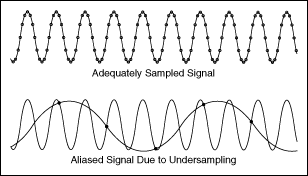

# Convolution reminder

For an input feature map with dimensions $n_h \times n_w \times n_c$, using a convolution layer with filter size $f$, padding $p$, stride $s$, and number of filters $n_f$, the output dimensions are:

$$
\left[n_h, n_w, n_c \right] * \left[f, f, n_c \right] = 
\left[
\left\lfloor \frac{n_h + 2p - f}{s} \right\rfloor + 1
\quad,\quad
\left\lfloor \frac{n_w + 2p - f}{s} \right\rfloor + 1
\quad,\quad
n_f
\right]
$$

where:

- $n_h$ → height of the input feature map
- $n_w$ → width of the input feature map
- $n_c$ → number of channels in the input feature map
- $f$ → size of the convolution filter (kernel)
- $p$ → padding size
- $s$ → stride length
- $n_f$ → number of filters (output channels)

## Interesting notions

### Aliasing

When you downsample, high-frequency patterns get misrepresented as lower-frequency patterns causing sensitivity to small shifts.

Popular methods to avoid aliasing:

- Downsampling images using interpolation that includes anti-aliasing
  - area interpolation (common for downscaling)
  - bicubic / bilinear with antialias=True (common in modern libraries)
- Average pooling
- Strided convolution for pooling

### Feature hierarchy intuition

CNNs naturally learn a hierarchy of representations due to receptive field growth + depth:

- Early layers: edges, corners, simple textures
- Middle layers: motifs, repeated patterns, object parts
- Deep layers: object-level concepts (faces, wheels, etc.)

### Atrous convolution

TO-DO: add a link to the relevant section when available

Atrous (dilated) convolution is a convolution where the kernel elements are spaced apart by inserting gaps, controlled by a dilation rate.

It increases the receptive field without increasing the number of parameters or reducing the spatial resolution. This solves the problem of needing more context while keeping feature maps dense, which is important for segmentation. It is often used to replace pooling/striding in late layers to preserve detail.

Atrous convolution is a key component in DeepLab-style models for semantic segmentation.
