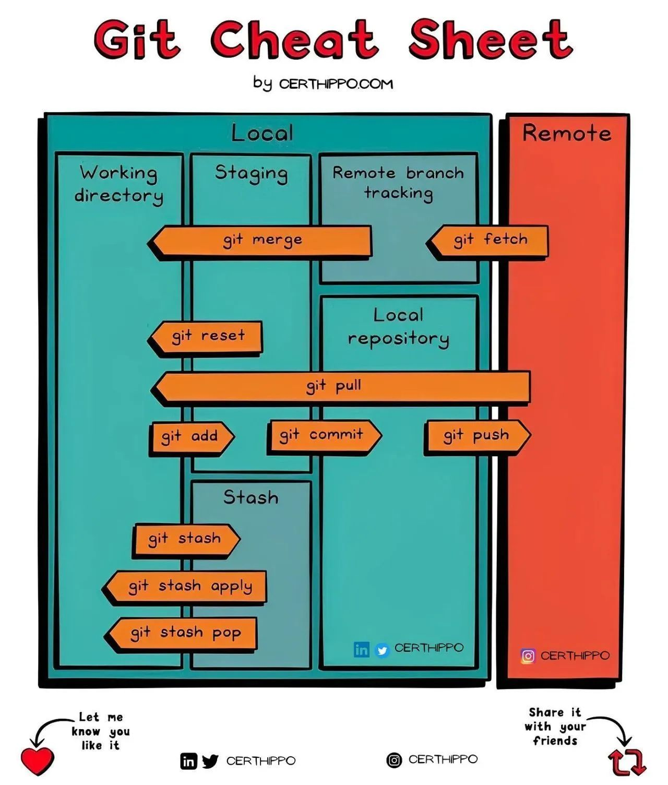

# Git resources

Simple and easy to use Git resources for beginners.

The best website to learn Git: https://learngitbranching.js.org/

An image is worth a thousand words. Here is a cheat sheet for Git commands:

